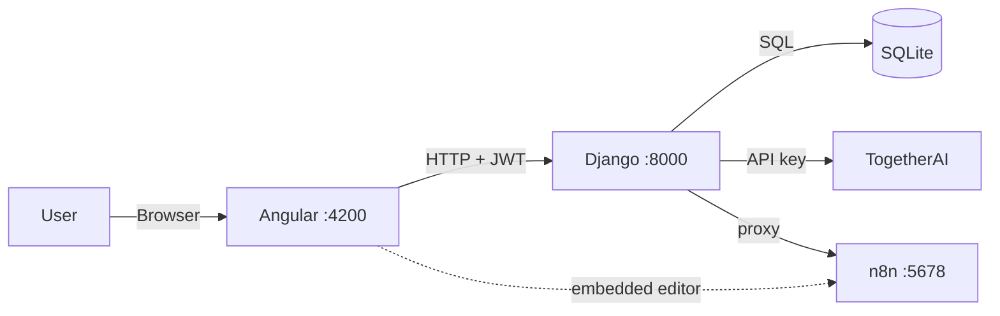

# AIMIx

> AI pipeline builder — chain multi-step LLM workflows, with an embedded n8n automation studio.

AIMIx lets you define a sequence of steps, each with its own model and prompt,
and run them as a chain: the output of step 1 becomes the input to step 2. On
top of that sits a `/workflows` page that embeds n8n, so you can generate,
edit, and run full automation workflows from natural language without leaving
the app.

A Django backend owns pipelines, auth, and every outbound AI call; an Angular
frontend provides the builder UI.

## Stack

| Layer | Technology |
|---|---|
| Backend | Django, Django REST Framework, SimpleJWT, `django-cors-headers` |
| Frontend | Angular 21 (standalone components), RxJS, Marked |
| Automation | n8n (embedded, proxied through Django) |
| LLM | TogetherAI via the Together Python SDK |
| Database | SQLite |
| Tooling | `uv` (Python), npm |

## Quick start

```bash
make install                        # uv sync + npm install (frontend + n8n-engine)
echo "TOGAI_API_KEY=..." > backend/.env
make run-aimix                      # backend :8000, frontend :4200, n8n :5678
```

`make superuser` creates a Django admin account if you need one.

For the n8n workflow controls, create an API key from the embedded designer
(n8n settings) and add it to `backend/.env`:

```bash
N8N_BASE_URL=http://localhost:5678
N8N_PUBLIC_URL=http://localhost:5678
N8N_API_KEY=your-n8n-api-key
```

`N8N_API_KEY` is used only by the Django proxy — the browser never receives it.

## Commands

| Command | Does |
|---|---|
| `make install` | Python venv via `uv` + npm deps for frontend and n8n |
| `make run-aimix` | Run backend, frontend, and n8n concurrently |
| `make run-backend` / `run-frontend` / `run-n8n` | Run one service |
| `make run-llm` | Standalone LLM script (`backend/test_llm_standalone.py`) |
| `make superuser` | Create a Django superuser |
| `make kill-back` / `kill-front` / `kill-n8n` / `kill-all` | Stop services |

## Architecture



The backend is a deliberate chokepoint: it proxies both TogetherAI and the n8n
public API so neither key ever reaches the browser.

### Pipeline execution

`backend/api/endpoints/pipelines.py` → `run_pipeline` is the core loop. On
`POST /api/pipelines/<id>/run` with `{"input": "..."}`:

1. Fetch the pipeline and iterate its `PipelineStep` records in `order`.
2. Substitute the running value into the step's prompt — replacing `{input}` if
   the template contains it, otherwise appending to the end.
3. Call the configured model through `server_llm.generate_response`.
4. The step's output becomes the next step's input.
5. Return the final output plus every intermediate result for display.

### Chat streaming

The chat endpoint uses `StreamingHttpResponse` and
`server_llm.generate_streaming_response`, which yields chunks as TogetherAI
produces them. The frontend deliberately uses the native `fetch` API rather than
`HttpClient` here, reading `response.body.getReader()` in a loop to get the
token-by-token typing effect — `HttpClient` can't expose a `ReadableStream`.

### Auth

`POST /api/login` returns `{access, refresh}`, stored in `localStorage`. Every
protected request must carry `Authorization: Bearer <access_token>`. An
"Unauthorized" error usually just means the access token expired.

### Embedded n8n studio

The `/workflows` page keeps n8n inside AIMIx:

- **AI Builder** — takes a natural-language request, discovers the installed n8n
  node catalog, asks the LLM for a plan, and creates an **inactive draft**
  workflow for review.
- **Designer** — embeds the native n8n editor rather than recreating it.
- **Workflows** — lists workflows via the Django proxy; edit, activate,
  deactivate, trigger webhooks.
- **Executions** — run history, retry failed runs, stop active ones.

## Project structure

```
backend/
  api/
    models.py            # Pipeline, PipelineStep, WorkflowChatSession, WorkflowChatMessage
    serializers.py       # Nested write for pipeline steps
    urls.py              # Route table
    endpoints/           # Thin DRF views: auth · chat · pipelines · n8n
    services/            # Business logic:
                         #   llm.py, pipeline_runner.py, pipeline_generation.py
                         #   n8n.py, n8n_workflow_generation.py, workflow_autofix.py
  server_llm/
    server_llm.py        # ★ TogetherAI calls — sync and streaming
    data_models.py
  backend/settings.py

frontend/src/app/
  core/auth/             # auth.service.ts — login and registration
  features/
    auth/ chat/ pipelines/ workflows/
  app.routes.ts

n8n-engine/              # Pinned n8n install (data in n8n-data/)
```

The split to respect: `endpoints/` stays thin — validation and response shaping
only — while `services/` holds the logic. Anything that calls a model belongs in
`services/llm.py` or `server_llm/`.

### Data model

| Model | Purpose |
|---|---|
| `Pipeline` | Named pipeline owned by a user |
| `PipelineStep` | `order`, `prompt` (with `{input}` placeholder), `model` |
| `WorkflowChatSession` | An n8n build conversation: state, plan, pending questions, linked workflow and execution ids |
| `WorkflowChatMessage` | Role + JSON content within a session |

### API

All routes under `/api`.

| Group | Endpoints |
|---|---|
| Auth | `POST /register`, `POST /login`, `POST /token/refresh`, `GET /protected` |
| Chat | `POST /chat` (streaming) |
| Pipelines | `GET\|POST /pipelines/` (ViewSet), `POST /pipelines/<id>/run`, `POST /pipelines/generate` |
| n8n — status | `GET /n8n/health`, `GET /n8n/info`, `GET /n8n/nodes` |
| n8n — workflows | `GET /n8n/workflows`, `POST /n8n/workflows/generate`, `GET /n8n/workflows/<id>`, `POST .../activate`, `.../deactivate`, `.../autofix` |
| n8n — executions | `GET /n8n/executions`, `GET /n8n/executions/<id>`, `POST .../retry`, `.../stop` |
| n8n — webhooks | `POST /n8n/webhooks/<path>` |

## Configuration

`backend/.env`:

| Variable | Required | Purpose |
|---|---|---|
| `TOGAI_API_KEY` | Yes | TogetherAI API key |
| `N8N_BASE_URL` | For `/workflows` | n8n API base, e.g. `http://localhost:5678` |
| `N8N_PUBLIC_URL` | For `/workflows` | URL the embedded editor loads from |
| `N8N_API_KEY` | For `/workflows` | n8n API key — server-side only |

## Extending

**New frontend page**

```bash
cd frontend && npx ng generate component features/my-feature
```

Then add the route in `src/app/app.routes.ts`:

```typescript
{ path: 'my-feature', component: MyFeatureComponent, canActivate: [authGuard] }
```

**New backend endpoint**

1. If you need storage, add a model in `backend/api/models.py`, then
   `makemigrations` and `migrate`.
2. Put the logic in `backend/api/services/`, and a thin view in
   `backend/api/endpoints/`.
3. Register the path in `backend/api/urls.py`.

## Troubleshooting

| Symptom | Cause |
|---|---|
| CORS error | `django-cors-headers` config in `settings.py` — it ships pre-configured |
| "Unauthorized" | Access token expired; log out and back in |
| n8n panels empty | `N8N_API_KEY` missing or n8n not running |

## License

Apache 2.0 — see [`LICENSE`](LICENSE).
