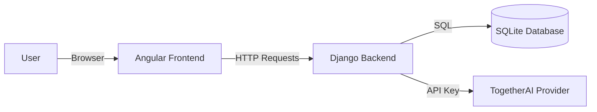

# AIMIx Project Documentation

## 1. Project Overview
AIMIx is an AI Pipeline Builder application that allows users to create, configure, and execute multi-step AI workflows. Users can define a sequence of steps where each step uses a specific Large Language Model (LLM) and prompt. The output of one step is automatically fed as input to the next, enabling complex chaining of AI tasks.

The project consists of a **Django** backend that manages pipelines and interacts with AI models (via TogetherAI), and an **Angular** frontend that provides a user-friendly interface for building and running these pipelines.

---

## 2. Architecture & Design Principle

The application follows a standard **Client-Server Architecture**.

### High-Level Diagram


### Data Flow
1.  **Frontend (Angular)**: Handles user interactions, manages state, and renders UI. It makes HTTP requests to the Backend.
2.  **Backend (Django)**: Receives requests, validates data, interacts with the Database, and communicates with external AI services.
3.  **Database**: Stores persistent data like User accounts, Pipeline definitions, and Steps.
4.  **AI Service**: The backend acts as a proxy to TogetherAI, securing the API key and handling the raw API calls.

---

## 3. Tech Stack in Detail

### Backend (Python/Django)
-   **Django REST Framework (DRF)**: Used to build the API. It handles serialization (converting DB models to JSON) and view logic.
-   **SimpleJWT**: Handles authentication. The server issues a `access_token` and `refresh_token` upon login. The frontend requires the `access_token` in headers for protected routes.
-   **Together Python SDK**: Used to communicate with the LLM provider.
-   **StreamingHttpResponse**: Used by the Chat endpoint to stream AI responses token-by-token to the client.

### Frontend (Angular 21)
-   **Standalone Components**: The app uses modern Angular Standalone Components (no `AppModule`).
-   **RxJS**: Used for handling asynchronous HTTP requests (Login, Saving Pipelines).
-   **Fetch API (for Streaming)**: The Chat component uses the native browser `fetch` API instead of `HttpClient` to handle streaming bodies via `ReadableStream`.
-   **Marked**: A library to convert Markdown output from LLMs into HTML for display.

---

## 4. Deep Dive: Key Workflows

### A. Authentication Flow
1.  User enters credentials in `LoginComponent`.
2.  `AuthService.login()` sends `POST /api/login`.
3.  Backend checks credentials and returns `{access: "...", refresh: "..."}`.
4.  Frontend saves these tokens in `localStorage`.
5.  **Critical**: For subsequent requests (like saving a pipeline), headers must include `Authorization: Bearer <token>`.

### B. Pipeline Creation Flow
**File**: `frontend/.../pipeline-builder.component.ts` maps to `backend/api/views.py`

1.  **UI State**: The frontend maintains a `pipeline` object:
    ```json
    {
      "name": "My Pipeline",
      "steps": [
        { "order": 1, "prompt": "Translate {input}", "model": "Llama-3" }
      ]
    }
    ```
2.  **Saving**: When User clicks "Save":
    -   Frontend sends `POST /api/pipelines/`.
    -   Backend `PipelineViewSet` creates the `Pipeline` record.
    -   Backend iterates over `steps` data and creates `PipelineStep` records linked to that pipeline.
    -   **Important**: The `PipelineSerializer` handles nested writing of steps.

### C. Pipeline Execution Flow (The "Magic")
**File**: `backend/api/views.py` function `run_pipeline`

1.  **Trigger**: User clicks "Run" on a saved pipeline.
2.  **Request**: Frontend sends `POST /api/pipelines/<ID>/run` with `{ "input": "Hello World" }`.
3.  **Backend Logic**:
    -   Fetches the `Pipeline` from DB.
    -   **Loop**: Iterates through each `PipelineStep` in order.
    -   **Prompt Engineering**:
        -   If the prompt contains `{input}`, it replaces it with the current data.
        -   If not, it appends the input to the end.
    -   **AI Call**: Calls `server_llm.generate_response`.
    -   **Chaining**: The `output` of Step 1 becomes variables `current_input` for Step 2.
    -   **History**: It collects intermediate results to return to the user.
4.  **Response**: Returns final output + intermediate steps to display in UI.

### D. Chat with Streaming
**File**: `frontend/.../chat.component.ts`

-   Unlike standard REST calls, this uses **Streaming**.
-   **Backend**: `server_llm.generate_streaming_response` yields chunks of text as they arrive from TogetherAI.
-   **Frontend**: Uses `response.body.getReader()` to read the stream loop. It continually updates the UI text variable as chunks arrive, creating the "typing" effect.

---

## 5. File Structure Reference

| Directory / File | Purpose |
| :--- | :--- |
| **`backend/api/models.py`** | Defines `Pipeline` and `PipelineStep` database tables. |
| **`backend/api/views.py`** | Contains rules for ALL endpoints (`run_pipeline`, `chat_view`, `PipelineViewSet`). |
| **`backend/api/serializers.py`** | Converts complex Database objects into JSON for the API. |
| **`backend/server_llm/server_llm.py`** | **The Brain**. Contains the actual logic to call TogetherAI. |
| **`frontend/src/app/auth.service.ts`** | Central place for Login logic. |
| **`frontend/src/app/pipeline-builder/`** | Contains the complex UI for drag-and-drop creation of workflows. |

---

## 6. Setup & Development

### Running the App
1.  **Install**: `make install`
    -   (Sets up Python venv `uv`, installs Node modules).
2.  **Configure**: Create `backend/.env` with `TOGAI_API_KEY=...`.
3.  **Run**: `make run-aimix`
    -   Starts Backend on `localhost:8000`.
    -   Starts Frontend on `localhost:4200`.

### Common Issues
-   **CORS Error**: If frontend can't talk to backend, ensure `django-cors-headers` is configured in `settings.py` (It is pre-configured).
-   **Auth Error**: If "Unauthorized", your token expired. Log out and Log back in.
-   **LLM Error**: If "List index out of range", update `server_llm.py` (fixed in recent patch).

---

use this document as your map. If you are stuck on *Frontend* visual logic, look in `src/app`. If you are stuck on *Business Logic* (how the AI is called, how data is saved), look in `backend/api` or `backend/server_llm`.

---

## 7. How to Extend the Project

This section is for developers who want to add new features.

### Adding a New Frontend Page

1.  **Generate Component**:
    Use the Angular CLI to generate the files.
    ```bash
    cd frontend/AIMIx
    npx ng generate component pages/my-new-page
    ```
2.  **Add Route**:
    Open `src/app/app.routes.ts`. Add your new route mapping:
    ```typescript
    { path: 'my-feature', component: MyNewPageComponent, canActivate: [authGuard] }
    ```
3.  **Add Logic**:
    Edit `src/app/pages/my-new-page/my-new-page.component.ts`. If you need data from the backend:
    -   Inject `HttpClient` in the constructor.
    -   Make requests to `http://127.0.0.1:8000/api/...`.

### Adding a New Backend Process

1.  **Define Model (Optional)**:
    If you need to store new data, edit `backend/api/models.py`.
    ```python
    class MyModel(models.Model):
        ...
    ```
    Then run `python manage.py makemigrations` and `migrate`.
2.  **Create View Logic**:
    Edit `backend/api/views.py`.
    ```python
    @api_view(['POST'])
    @permission_classes([IsAuthenticated])
    def my_custom_process(request):
        # Your logic here
        return Response({"status": "done"})
    ```
    -   If your process is complex or interacts with AI, consider adding a helper class in `server_llm/`.
3.  **Add URL**:
    Edit `backend/api/urls.py` to expose your view.
    ```python
    path('my-process', my_custom_process, name='my_process')
    ```

