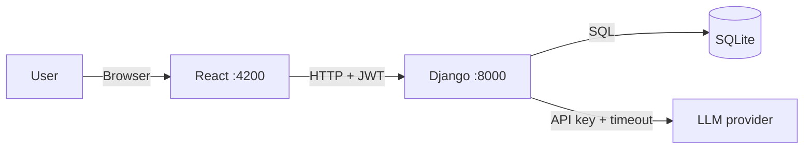

# AIMIx

> AI pipeline builder — chain multi-step LLM workflows.

AIMIx lets you define a sequence of steps, each with its own model and prompt,
and run them as a chain: the output of step 1 becomes the input to step 2.

A Django backend owns pipelines, auth, and every outbound AI call; a React
frontend provides the builder UI.

## Stack

| Layer | Technology |
|---|---|
| Backend | Django, Django REST Framework, SimpleJWT, `django-cors-headers` |
| Frontend | React 19 + Vite, React Router, Tailwind CSS 4, Marked |
| LLM | TogetherAI via the Together Python SDK |
| Database | SQLite |
| Tooling | `uv` (Python), npm |

## Quick start

```bash
make install                        # uv sync + npm install (frontend)
cp backend/.env.example backend/.env  # then fill in your LLM key
make run-aimix                      # backend :8000, frontend :4200
```

`make superuser` creates a Django admin account if you need one.

## Documentation

In-depth guides live in [`docs/`](docs/README.md): getting started,
architecture and request traces, backend and frontend references, the LLM
provider layer, the full API reference, a development guide, and known issues.

## Commands

| Command | Does |
|---|---|
| `make install` | Python venv via `uv` + npm deps for the frontend |
| `make run-aimix` | Run backend and frontend concurrently |
| `make run-backend` / `run-frontend` | Run one service |
| `make run-llm` | Probe the configured provider (`manage.py llm_probe`) |
| `make migrate` / `make superuser` | Apply migrations · create an admin user |
| `make lint` / `make format` / `make typecheck` | Ruff · Ruff --fix · mypy |
| `make test` | Backend pytest + frontend vitest |
| `make check` | Everything CI runs: lint, types, Django check, both suites, build |
| `make kill-back` / `kill-front` / `kill-all` | Stop services |

## Architecture



The backend is a deliberate chokepoint: it holds the provider key, so the key
never reaches the browser, and every outbound call is bounded by
`LLM_TIMEOUT_SECONDS`.

### Pipeline execution

`api/services/pipelines.py` → `run` is the core loop. On
`POST /api/pipelines/<id>/run` with `{"input": "..."}`:

1. The endpoint validates the body with `RunPipelineSerializer`.
2. `repositories/pipelines.get_owned` fetches the pipeline **scoped to the
   caller**, so someone else's pipeline is indistinguishable from a missing one.
3. The service groups `PipelineStep` records by `stage` and runs the stages in
   ascending order. Steps that share a stage run in parallel (at most
   `PIPELINE_MAX_PARALLEL_STEPS` at once) on the same input, which is
   substituted into each prompt — replacing `{input}` where present, otherwise
   appending it.
4. Each step calls the configured provider, bounded by `LLM_TIMEOUT_SECONDS`. A
   provider failure raises a domain error, never an empty string.
5. A stage's output becomes the next stage's input; parallel outputs are joined
   under a heading per step. The final output plus every step's result is
   returned for display, grouped by stage.

### Chat streaming

The chat endpoint uses `StreamingHttpResponse` over the provider's own stream.
`api/services/chat.py` pulls the first chunk eagerly, so a failure that happens
before the response is committed still becomes a proper status code rather than a
200 with an error inside it.

On the client, `core/api/client.ts` reads `response.body.getReader()` in a loop
and `useChatStream` appends each chunk, giving the token-by-token typing effect.

### Auth

`POST /api/login` returns `{access, refresh}`, stored in `localStorage`. Every
protected request must carry `Authorization: Bearer <access_token>`. An
"Unauthorized" error usually just means the access token expired.

## Project structure

```
backend/
  config/
    settings/            # base.py + local · test · production
    urls.py              # project routes
  api/
    urls.py              # route table, no logic
    endpoints/           # thin DRF views: auth · chat · models · pipelines
    serializers/         # request + response contracts
    services/            # business logic: pipelines, chat, prompts, llm, catalog
    repositories/        # data access; ownership filtering lives here
    models.py            # Pipeline, PipelineStep
    exceptions.py        # domain errors (code + HTTP status)
    errors.py            # ★ the one place that shapes an error response
    management/commands/ # llm_probe
  llm/                   # provider layer — no Django import anywhere in here
    base.py              # ★ LLMProvider Protocol + the shared transport
    providers/           # openrouter.py · together.py
    registry.py          # name -> factory map
    catalog.py           # model metadata; source of truth for valid model ids
  tests/                 # pytest suite

frontend/src/
  main.tsx               # entry: router + auth provider
  App.tsx                # nav shell + route table
  core/
    api/                 # ★ the only place that calls the backend
                         #   endpoints.ts (paths), types.ts (payloads),
                         #   client.ts (bearer token, timeout, error mapping)
    auth/                # tokenStorage.ts (sole localStorage owner),
                         #   AuthContext.tsx, RequireAuth.tsx (route guard)
    hooks/useModels.ts   # model catalogue from GET /api/models
    markdown/            # sanitised Markdown rendering
  features/
    auth/ chat/ pipelines/
```

The split to respect: `endpoints/` stays thin — validate, call a service, shape
the result — while `services/` holds the logic. Services raise domain errors
instead of building responses, and `llm/` knows nothing about Django, so it can
be tested with a fake client and reused elsewhere.

On the frontend the same rule applies outward: components render and handle
input, while every HTTP call, the bearer token and all payload types live in
`src/core/`. A component never calls `fetch` and never touches `localStorage`.

### Data model

| Model | Purpose |
|---|---|
| `Pipeline` | Named pipeline owned by a user |
| `PipelineStep` | `order`, `prompt` (with `{input}` placeholder), `model` |

### API

All routes under `/api`.

| Group | Endpoints |
|---|---|
| Auth | `POST /register`, `POST /login`, `POST /token/refresh`, `GET /protected` |
| Chat | `POST /chat` (streaming) |
| Models | `GET /models` — the model ids the pipeline services accept |
| Pipelines | `GET\|POST /pipelines/` (ViewSet), `POST /pipelines/<id>/run`, `POST /pipelines/generate` |

Everything except `POST /register` and `POST /login` requires
`Authorization: Bearer <access>`; DRF is configured to deny by default.

### Error contract

Every error — validation, auth, missing record, provider failure — answers with
the same body, produced by `api/errors.py`:

```json
{ "error": "provider_timeout", "detail": "openrouter did not respond within 60s." }
```

`error` is a stable code to branch on; `detail` is the human-readable message.
The client surfaces it as `ApiError.code` / `ApiError.message`.

| Code | Status | Meaning |
|---|---|---|
| `validation_error` | 400 | The request body failed its serializer |
| `not_authenticated` | 401 | Missing or expired access token |
| `permission_denied` | 403 | Authenticated but not allowed |
| `not_found` | 404 | No such record, or it belongs to someone else |
| `provider_not_configured` | 503 | No API key for the selected provider |
| `provider_unavailable` | 502 | The provider rejected the request |
| `provider_timeout` | 504 | The provider exceeded `LLM_TIMEOUT_SECONDS` |
| `upstream_response_invalid` | 502 | The planner returned unusable output |

## Configuration

`backend/.env`:

| Variable | Required | Purpose |
|---|---|---|
| `DJANGO_SECRET_KEY` | In production | App refuses to start without it |
| `LLM_PROVIDER` | No | `openrouter` (default) or `togetherai` |
| `OPEN_ROUTER_KEY` | For OpenRouter | Provider API key |
| `TOGAI_API_KEY` | For TogetherAI | Provider API key |
| `LLM_TIMEOUT_SECONDS` | No | Bounds every provider call (default 60) |
| `PIPELINE_MAX_PARALLEL_STEPS` | No | Parallel steps of one stage run at once (default 4) |

See [`backend/.env.example`](backend/.env.example) for the full list.

Settings are split under `backend/config/settings/`: `local.py` (the `manage.py`
default), `test.py` (offline and deterministic), and `production.py`, which
refuses to start with `DEBUG=True`, a missing `SECRET_KEY`, or empty
`ALLOWED_HOSTS`.

## Extending

**New frontend page**

Add a component under `src/features/<feature>/`.

Then add it to the route table in `src/App.tsx`, inside the guarded block so it
inherits authentication:

```tsx
<Route element={<AppShell />}>
  <Route path="/my-feature" element={<MyFeaturePage />} />
</Route>
```

Give it a typed API function in `src/core/api/` rather than calling `fetch` from
the component.

**New backend endpoint**

1. If you need storage, add a model in `api/models.py`, then `makemigrations` and
   `migrate`. Put queryset logic in `api/repositories/`.
2. Declare the request contract as a serializer in `api/serializers/`.
3. Put the logic in `api/services/`. Raise a `DomainError` from
   `api/exceptions.py` to signal failure — never build an error response.
4. Add a thin view in `api/endpoints/`: validate, call the service, shape the
   result.
5. Register the path in `api/urls.py`, and add a test under `backend/tests/`.

**New LLM provider**

1. Add `llm/providers/<name>.py` with a `build(config) -> LLMProvider` that
   returns an `OpenAICompatibleProvider`, or your own class honouring the
   `LLMProvider` protocol in `llm/base.py`.
2. Add one entry to `FACTORIES` in `llm/registry.py` — no `if` chain to edit.
3. Add its catalogue to `llm/catalog.py` and to `CATALOGS`.
4. Add its key and default model to `config/settings/base.py` and
   `.env.example`.

## Troubleshooting

| Symptom | Cause |
|---|---|
| CORS error | The Vite dev server proxies `/api` to Django, so there is normally no cross-origin request at all; check `vite.config.ts` |
| `not_authenticated` | Access token expired; log out and back in |
| `provider_not_configured` | No API key for `LLM_PROVIDER` in `backend/.env` |
| `provider_timeout` | Provider slower than `LLM_TIMEOUT_SECONDS`; raise it or pick a faster model |
| Model rejected on save | The id is not in the provider catalogue — `make run-llm` lists the valid ones |

## License

Apache 2.0 — see [`LICENSE`](LICENSE).
