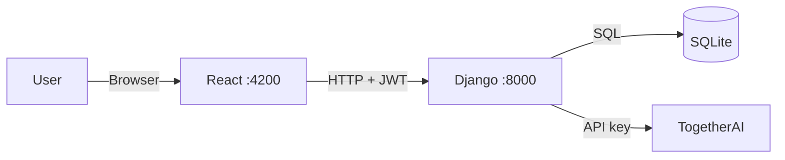

# AIMIx

> AI pipeline builder — chain multi-step LLM workflows.

AIMIx lets you define a sequence of steps, each with its own model and prompt,
and run them as a chain: the output of step 1 becomes the input to step 2.

A Django backend owns pipelines, auth, and every outbound AI call; a React
frontend provides the builder UI.

## Stack

| Layer | Technology |
|---|---|
| Backend | Django, Django REST Framework, SimpleJWT, `django-cors-headers` |
| Frontend | React 19 + Vite, React Router, Tailwind CSS 4, Marked |
| LLM | TogetherAI via the Together Python SDK |
| Database | SQLite |
| Tooling | `uv` (Python), npm |

## Quick start

```bash
make install                        # uv sync + npm install (frontend)
cp backend/.env.example backend/.env  # then fill in your LLM key
make run-aimix                      # backend :8000, frontend :4200
```

`make superuser` creates a Django admin account if you need one.

## Commands

| Command | Does |
|---|---|
| `make install` | Python venv via `uv` + npm deps for the frontend |
| `make run-aimix` | Run backend and frontend concurrently |
| `make run-backend` / `run-frontend` | Run one service |
| `make run-llm` | Standalone LLM script (`backend/test_llm_standalone.py`) |
| `make superuser` | Create a Django superuser |
| `make kill-back` / `kill-front` / `kill-all` | Stop services |

## Architecture



The backend is a deliberate chokepoint: it proxies every TogetherAI call so the
key never reaches the browser.

### Pipeline execution

`backend/api/endpoints/pipelines.py` → `run_pipeline` is the core loop. On
`POST /api/pipelines/<id>/run` with `{"input": "..."}`:

1. Fetch the pipeline and iterate its `PipelineStep` records in `order`.
2. Substitute the running value into the step's prompt — replacing `{input}` if
   the template contains it, otherwise appending to the end.
3. Call the configured model through `server_llm.generate_response`.
4. The step's output becomes the next step's input.
5. Return the final output plus every intermediate result for display.

### Chat streaming

The chat endpoint uses `StreamingHttpResponse` and
`server_llm.generate_streaming_response`, which yields chunks as TogetherAI
produces them. The frontend deliberately uses the native `fetch` API rather than
`HttpClient` here, reading `response.body.getReader()` in a loop to get the
token-by-token typing effect — `HttpClient` can't expose a `ReadableStream`.

### Auth

`POST /api/login` returns `{access, refresh}`, stored in `localStorage`. Every
protected request must carry `Authorization: Bearer <access_token>`. An
"Unauthorized" error usually just means the access token expired.

## Project structure

```
backend/
  api/
    models.py            # Pipeline, PipelineStep
    serializers.py       # Nested write for pipeline steps
    urls.py              # Route table
    endpoints/           # Thin DRF views: auth · chat · pipelines
    services/            # Business logic:
                         #   llm.py, pipeline_runner.py, pipeline_generation.py
  server_llm/
    server_llm.py        # ★ TogetherAI calls — sync and streaming
    data_models.py
  backend/settings.py

frontend/src/
  main.tsx               # entry: router + auth provider
  App.tsx                # nav shell + route table
  core/
    api/                 # ★ the only place that calls the backend
                         #   endpoints.ts (paths), types.ts (payloads),
                         #   client.ts (bearer token, timeout, error mapping)
    auth/                # tokenStorage.ts (sole localStorage owner),
                         #   AuthContext.tsx, RequireAuth.tsx (route guard)
    hooks/useModels.ts   # model catalogue from GET /api/models
    markdown/            # sanitised Markdown rendering
  features/
    auth/ chat/ pipelines/
```

The split to respect: `endpoints/` stays thin — validation and response shaping
only — while `services/` holds the logic. Anything that calls a model belongs in
`services/llm.py` or `server_llm/`.

On the frontend the same rule applies outward: components render and handle
input, while every HTTP call, the bearer token and all payload types live in
`src/core/`. A component never calls `fetch` and never touches `localStorage`.

### Data model

| Model | Purpose |
|---|---|
| `Pipeline` | Named pipeline owned by a user |
| `PipelineStep` | `order`, `prompt` (with `{input}` placeholder), `model` |

### API

All routes under `/api`.

| Group | Endpoints |
|---|---|
| Auth | `POST /register`, `POST /login`, `POST /token/refresh`, `GET /protected` |
| Chat | `POST /chat` (streaming) |
| Models | `GET /models` — the model ids the pipeline services accept |
| Pipelines | `GET\|POST /pipelines/` (ViewSet), `POST /pipelines/<id>/run`, `POST /pipelines/generate` |

## Configuration

`backend/.env`:

| Variable | Required | Purpose |
|---|---|---|
| `TOGAI_API_KEY` | Yes | TogetherAI API key |

See [`backend/.env.example`](backend/.env.example) for the full list, including
the Django and LLM-provider settings.

## Extending

**New frontend page**

Add a component under `src/features/<feature>/`.

Then add it to the route table in `src/App.tsx`, inside the guarded block so it
inherits authentication:

```tsx
<Route element={<AppShell />}>
  <Route path="/my-feature" element={<MyFeaturePage />} />
</Route>
```

Give it a typed API function in `src/core/api/` rather than calling `fetch` from
the component.

**New backend endpoint**

1. If you need storage, add a model in `backend/api/models.py`, then
   `makemigrations` and `migrate`.
2. Put the logic in `backend/api/services/`, and a thin view in
   `backend/api/endpoints/`.
3. Register the path in `backend/api/urls.py`.

## Troubleshooting

| Symptom | Cause |
|---|---|
| CORS error | The Vite dev server proxies `/api` to Django, so there is normally no cross-origin request at all; check `vite.config.ts` |
| "Unauthorized" | Access token expired; log out and back in |

## License

Apache 2.0 — see [`LICENSE`](LICENSE).
