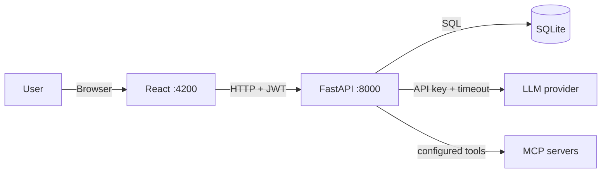

# AIMIx

> AI pipeline builder — coordinate agents across workflow stages.

AIMIx lets you build pipelines of agents, each with a role, model, prompt, and
tool policy. Stages run in order; agents in the same stage run in parallel, and
their results feed the next stage. Agents can use built-in pipeline functions
and configured MCP tools.

A FastAPI backend owns pipelines, auth, and every outbound AI call; a React
frontend provides the builder UI.

## Stack

| Layer | Technology |
|---|---|
| Backend | FastAPI + Uvicorn, SQLAlchemy 2.0 + Alembic, pydantic-settings, PyJWT |
| Frontend | React 19 + Vite, React Router, Tailwind CSS 4, Marked |
| Agents and LLMs | LangGraph with OpenRouter (default) or TogetherAI models; MCP tools |
| Database | SQLite |
| Tooling | `uv` (Python), npm |

## Quick start

```bash
make install                        # uv sync + npm install (frontend)
cp backend/.env.example backend/.env  # then fill in your LLM key
make migrate                        # create the database (backend/aimix.sqlite3)
make run-aimix                      # backend :8000, frontend :4200
```

Register in the app, or run `make create-user USERNAME=alice`. The API's
interactive docs are at <http://127.0.0.1:8000/api/docs> (not in production).

Coming from the Django version? `make migrate && make import-django-db` copies your
accounts (same passwords) and pipelines from `backend/db.sqlite3`.

## Documentation

In-depth guides live in [`docs/`](docs/README.md): getting started,
architecture and request traces, backend and frontend references, the LLM
provider layer, the full API reference, a development guide, and known issues.

## Commands

| Command | Does |
|---|---|
| `make install` | Python venv via `uv` + npm deps for the frontend |
| `make run-aimix` | Apply pending migrations, then run backend and frontend concurrently |
| `make run-backend` / `run-frontend` | Run one service; backend applies pending migrations first |
| `make run-llm` | Probe the configured provider (`python -m api.cli llm-probe`) |
| `make migrate` / `make create-user USERNAME=…` | Apply Alembic migrations · create an account |
| `make import-django-db` | One-off: copy data from the old Django `db.sqlite3` |
| `make lint` / `make format` / `make typecheck` | Ruff · Ruff --fix · mypy |
| `make test` | Backend pytest + frontend vitest |
| `make check` | Everything CI runs: lint, types, both suites (incl. migrations check), build |
| `make kill-back` / `kill-front` / `kill-all` | Stop services |

## Architecture



The backend holds provider and MCP credentials, so they never reach the browser.
Provider calls use `LLM_TIMEOUT_SECONDS`; MCP calls use `MCP_TIMEOUT_SECONDS`,
and each chat or pipeline agent has `AGENT_TIMEOUT_SECONDS`.

### Pipeline execution

`api/services/pipelines.py` snapshots a saved pipeline through
`api/services/multiagent/mapper.py`; `multiagent/graph.py` executes the immutable
snapshot as a LangGraph `StateGraph`. On
`POST /api/pipelines/<id>/run` with `{"input": "..."}`:

1. The endpoint validates the body with `RunRequest`.
2. `repositories/pipelines.get_owned` fetches the pipeline **scoped to the
   caller**, so someone else's pipeline is indistinguishable from a missing one.
3. The graph runs stages in ascending order. Each saved step has its own agent
   node. Nodes in one stage receive the same input and run concurrently, up to
   `PIPELINE_MAX_PARALLEL_STEPS`; a join waits for the whole stage before the
   next one starts. Input replaces `{input}` in the prompt where present and is
   appended otherwise.
4. Each step runs a LangGraph agent with its selected model and role. Its
   `allowed_tools` policy grants all configured tools (`null`), none (`[]`), or
   named tools from `GET /api/agent-tools`. The agent may call tools before
   producing its final text.
5. A stage's output becomes the next stage's input; the join orders parallel
   outputs by saved step order under a heading per step, regardless of when the
   agents finish. The response includes every step's output and a metadata-only
   list of tool calls (name and success/error status).

The HTTP request still waits for the full run. Runs have no persisted
run history, resumable checkpoint, or approval flow for tool actions.

### Chat streaming

The chat endpoint runs a LangGraph agent using the configured provider model.
Its native tools list, inspect, and run the signed-in user's saved pipelines.
It also loads all tools from the MCP servers in `MCP_SERVERS` and streams only
the agent's text. `api/services/chat.py` pulls the first chunk eagerly, so a
failure before the response is committed still becomes a proper status code.

On the client, `core/api/client.ts` reads `response.body.getReader()` in a loop
and `useChatStream` appends each chunk, giving the token-by-token typing effect.

### Auth

`POST /api/login` returns `{access, refresh}`, stored in `localStorage`. Every
protected request must carry `Authorization: Bearer <access_token>`. An
"Unauthorized" error usually just means the access token expired.

## Project structure

```
backend/
  config/
    settings.py          # typed settings from env / backend/.env
  migrations/            # Alembic revisions
  api/
    main.py              # create_app(): the application factory
    routes.py            # route table, no logic; protected by default
    endpoints/           # thin routers: auth · chat · models · pipelines
    schemas/             # pydantic request + response contracts
    deps.py              # dependencies: db session, current user, provider
    services/            # business logic: pipelines, chat, accounts, prompts, llm
      agent_runtime.py    # shared chat/pipeline tool policy and error mapping
      multiagent/         # contracts, ORM mapper, stage graph, step agent
    repositories/        # data access; ownership filtering lives here
    models.py            # SQLAlchemy: User, Pipeline, PipelineStep
    security.py          # password hashing + JWT signing
    exceptions.py        # domain errors (code + HTTP status)
    errors.py            # ★ the one place that shapes an error response
    cli.py               # llm-probe · create-user · import-django-db
  llm/                   # provider layer — no web or database import in here
    base.py              # ★ LLMProvider Protocol + the shared transport
    providers/           # openrouter.py · together.py
    registry.py          # name -> factory map
    catalog.py           # model metadata; source of truth for valid model ids
  tests/                 # pytest suite

frontend/src/
  main.tsx               # entry: router + auth provider
  App.tsx                # nav shell + route table
  core/
    api/                 # ★ the only place that calls the backend
                         #   endpoints.ts (paths), types.ts (payloads),
                         #   client.ts (bearer token, timeout, error mapping)
    auth/                # tokenStorage.ts (sole localStorage owner),
                         #   AuthContext.tsx, RequireAuth.tsx (route guard)
    hooks/useModels.ts   # model catalogue from GET /api/models
    markdown/            # sanitised Markdown rendering
  features/
    auth/ chat/ pipelines/
```

The split to respect: `endpoints/` stays thin — validate, call a service, shape
the result — while `services/` holds the logic. Services raise domain errors
instead of building responses, and `llm/` knows nothing about FastAPI, so it can
be tested with a fake client and reused elsewhere.

On the frontend the same rule applies outward: components render and handle
input, while every HTTP call, the bearer token and all payload types live in
`src/core/`. A component never calls `fetch` and never touches `localStorage`.

### Data model

| Model | Purpose |
|---|---|
| `Pipeline` | Named pipeline owned by a user |
| `PipelineStep` | Stage/order, prompt, model, role, `allowed_tools` policy, output flag |

### API

All routes under `/api`.

| Group | Endpoints |
|---|---|
| Auth | `POST /register`, `POST /login`, `POST /token/refresh`, `GET /protected` |
| Chat | `POST /chat` (streaming) |
| Models | `GET /models` — the model ids the pipeline services accept |
| Agent tools | `GET /agent-tools` — available pipeline tools and their sources |
| Pipelines | `GET\|POST /pipelines/`, `GET\|PUT\|PATCH\|DELETE /pipelines/<id>/`, `POST /pipelines/<id>/run`, `POST /pipelines/generate` |

Everything except `POST /register`, `POST /login` and `POST /token/refresh`
requires `Authorization: Bearer <access>`; routes are protected by default in
`api/routes.py`.

### Error contract

Every error — validation, auth, missing record, provider failure — answers with
the same body, produced by `api/errors.py`:

```json
{ "error": "provider_timeout", "detail": "openrouter did not respond within 60s." }
```

`error` is a stable code to branch on; `detail` is the human-readable message.
The client surfaces it as `ApiError.code` / `ApiError.message`.

| Code | Status | Meaning |
|---|---|---|
| `validation_error` | 400 | The request body failed its schema |
| `not_authenticated` | 401 | Missing or expired access token |
| `permission_denied` | 403 | Authenticated but not allowed |
| `not_found` | 404 | No such record, or it belongs to someone else |
| `provider_not_configured` | 503 | No API key for the selected provider |
| `provider_unavailable` | 502 | The provider rejected the request |
| `provider_timeout` | 504 | A provider or agent request timed out |
| `tool_unavailable` | 502 | A configured MCP server or tool is unavailable |
| `upstream_response_invalid` | 502 | The planner returned unusable output |
| `server_error` | 500 | An unexpected failure (logged by the server) |

## Configuration

`backend/.env`:

| Variable | Required | Purpose |
|---|---|---|
| `SECRET_KEY` | In production | Signs the JWTs; production refuses to start without it |
| `APP_ENV` | No | `local` (default) or `production` |
| `DATABASE_URL` | No | SQLAlchemy URL (default `backend/aimix.sqlite3`) |
| `LLM_PROVIDER` | No | `openrouter` (default) or `togetherai` |
| `OPEN_ROUTER_KEY` | For OpenRouter | Provider API key |
| `TOGAI_API_KEY` | For TogetherAI | Provider API key |
| `LLM_TIMEOUT_SECONDS` | No | Bounds every provider call (default 3600 = one hour) |
| `PIPELINE_MAX_PARALLEL_STEPS` | No | Parallel steps of one stage run at once (default 4) |
| `MCP_SERVERS` | No | JSON object of MCP servers available to chat and pipeline agents (default `{}`) |
| `MCP_TIMEOUT_SECONDS` | No | Bounds MCP discovery and tool calls (default 30) |
| `AGENT_TIMEOUT_SECONDS` | No | Bounds one chat or pipeline step agent run (default 3600) |
| `AGENT_RECURSION_LIMIT` | No | Limits agent model/tool steps (default 25) |
| `AGENT_TOOL_DESCRIPTION_MAX_CHARS` | No | Maximum tool description length in the catalogue and planner prompt (default 300) |

See [`backend/.env.example`](backend/.env.example) for the full list.

Settings are one typed class in `backend/config/settings.py`. The old `DJANGO_*`
variable names are still accepted. With `APP_ENV=production` the app refuses to
start with `DEBUG=True`, a missing `SECRET_KEY`, or empty `ALLOWED_HOSTS`.

## Extending

**New frontend page**

Add a component under `src/features/<feature>/`.

Then add it to the route table in `src/App.tsx`, inside the guarded block so it
inherits authentication:

```tsx
<Route element={<AppShell />}>
  <Route path="/my-feature" element={<MyFeaturePage />} />
</Route>
```

Give it a typed API function in `src/core/api/` rather than calling `fetch` from
the component.

**New backend endpoint**

1. If you need storage, add a model in `api/models.py`, then
   `cd backend && uv run alembic revision --autogenerate -m "…"` (review it) and
   `make migrate`. Put query logic in `api/repositories/`.
2. Declare the request and response contracts as pydantic models in `api/schemas/`.
3. Put the logic in `api/services/`. Raise a `DomainError` from
   `api/exceptions.py` to signal failure — never build an error response.
4. Add a thin route in `api/endpoints/` on an `APIRouter`: take the schema, the
   dependencies it needs from `api/deps.py`, call the service, return a schema.
5. Add the router to `PROTECTED_ROUTERS` in `api/routes.py` (or, deliberately,
   `PUBLIC_ROUTERS`), and add a test under `backend/tests/`.

**New LLM provider**

1. Add `llm/providers/<name>.py` with a `build(config) -> LLMProvider` that
   returns an `OpenAICompatibleProvider`, or your own class honouring the
   `LLMProvider` protocol in `llm/base.py`.
2. Add one entry to `FACTORIES` in `llm/registry.py` — no `if` chain to edit.
3. Add its catalogue to `llm/catalog.py` and to `CATALOGS`.
4. Add its key, base URL and default model to `config/settings.py` (and the
   `llm_*` dict properties) and `.env.example`.

## Troubleshooting

| Symptom | Cause |
|---|---|
| CORS error | The Vite dev server proxies `/api` to the backend, so there is normally no cross-origin request at all; check `vite.config.ts` |
| `not_authenticated` | Access token expired; log out and back in |
| `provider_not_configured` | No API key for `LLM_PROVIDER` in `backend/.env` |
| `provider_timeout` | Provider slower than `LLM_TIMEOUT_SECONDS`; raise it or pick a faster model |
| Model rejected on save | The id is not in the provider catalogue — `make run-llm` lists the valid ones |

## License

Apache 2.0 — see [`LICENSE`](LICENSE).
