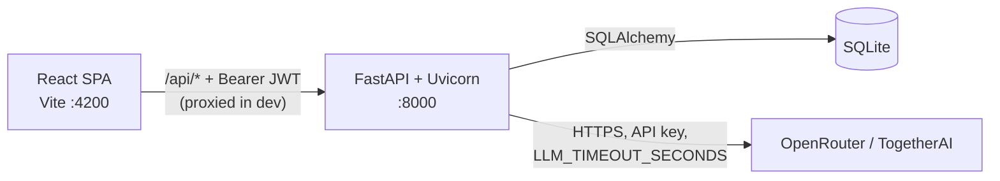
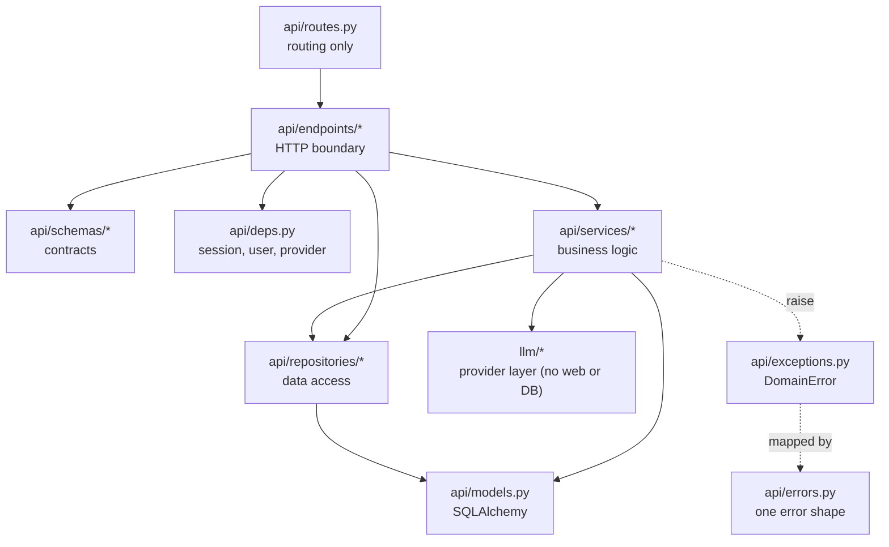
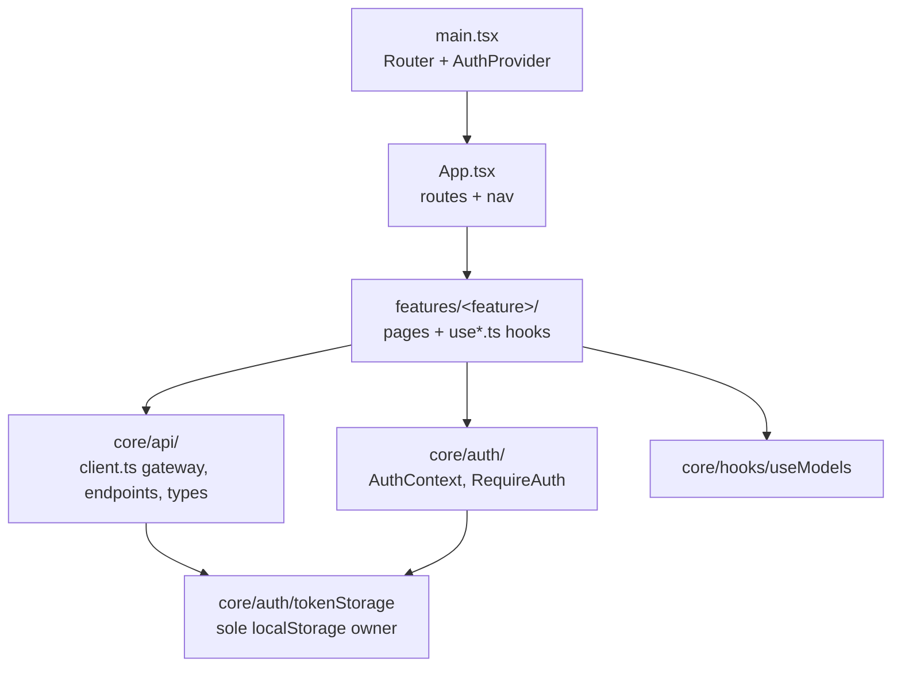
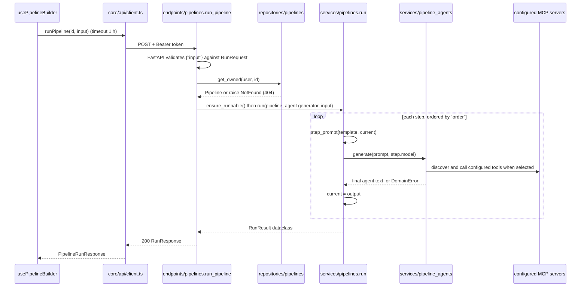

# Architecture

## System view



The backend is a **chokepoint**: it holds the provider API key (the browser never
sees it), validates every model id against a catalogue, and bounds every
outbound call with a timeout.

## Backend layers



Rules that keep this shape (full text in [AGENTS.md §2](../AGENTS.md)):

- **Endpoints are thin**: FastAPI validates the body against a pydantic schema,
  the endpoint calls a service or repository and returns a response schema. No
  business `if`s, no prompt building.
- **Protected by default**: every router except those in `PUBLIC_ROUTERS` is
  mounted behind the `current_user` dependency.
- **Services never touch HTTP**: they take and return plain Python values and
  dataclasses, and signal failure by raising a `DomainError`.
- **Only `api/errors.py` builds error responses**, always as
  `{"error": "<code>", "detail": "<message>"}`.
- **`llm/` never imports the web framework, the database or settings**: it
  receives a `ProviderConfig` dataclass.
  Only `api/services/llm.py` reads provider settings.
- **Ownership filtering lives in `api/repositories/`**, so "another user's
  pipeline" and "no such pipeline" look identical (404).

## Frontend layers



Components render and handle input. `fetch`, the bearer token, timeouts, and
error mapping live in `core/api/client.ts`; feature state lives in a
`use<Feature>.ts` hook next to the page.

## Request traces

### 1. Run a pipeline — `POST /api/pipelines/<id>/run`



The agent uses its selected model, the signed-in user's pipeline list and
inspect tools, and all configured MCP tools. Model, tool, and timeout failures
stop the whole run; there are no partial results. The planner still uses the
direct provider adapter.

### 2. Stream chat — `POST /api/chat`

1. `useChatStream.send` adds the user message and an empty AI message, then
   iterates `streamChatReply()` → `client.streamText()`, which reads
   `response.body.getReader()` and yields decoded chunks.
2. `endpoints/chat.chat` validates `{"prompt"}` and calls
   `services/chat.stream_reply(agent, prompt)`.
3. `services/agent` builds a LangGraph agent from the configured model, binds
   the signed-in user's native pipeline tools, and discovers tools from every
   server in `MCP_SERVERS`. Graph execution runs in one producer task, which
   sends assistant text through a queue. Model and MCP calls have timeouts;
   tool results stay out of the text stream.
4. `stream_reply` **pulls the first chunk eagerly**. If agent setup or a tool
   fails before text appears, a `DomainError` is raised while the response is
   still uncommitted, so the client gets a real 5xx error body.
5. After the first chunk the response is a `StreamingResponse`
   (`text/plain`); Starlette iterates the async generator. A failure
   mid-stream can no longer change the status, so it is logged
   (`chat.stream_interrupted`) and the stream simply ends.
6. The hook appends each chunk to the AI message; unmounting aborts the fetch.

### 3. Generate a pipeline — `POST /api/pipelines/generate`

1. `GenerateRequest` validates `description` and an optional
   `planner_model` (defaults to the configured default model).
2. `services/pipelines.generate` builds the planner prompt with
   `prompts.pipeline_generation_prompt` (it lists the allowed model ids) and
   calls the provider.
3. `parse_plan` extracts the first `{...}` block, parses JSON, requires `name`
   and a non-empty `steps` list, fills a missing `order`, and **replaces any
   model id not in the catalogue with the default model**. Unusable output →
   `upstream_response_invalid` (502).
4. The endpoint returns the plan **without saving it**. The user edits it in
   `AutoPipelinePage` and saves through the normal `POST /api/pipelines/`.

## Error flow

```
llm/ raises LLMError subclass
  → services translate via api/services/errors.PROVIDER_ERROR_MAP
  → DomainError (code + status) propagates out of the endpoint
  → FastAPI calls the handler installed by api/errors.install_error_handlers
  → {"error": code, "detail": message} with the mapped status
  → core/api/client.ts turns it into ApiError(message, status, code)
```

Request validation errors become 400 `validation_error`. Framework HTTP errors
(unknown route 404, 405, …) are mapped by `STATUS_CODES` in `api/errors.py`. An
unexpected exception becomes a 500 `server_error` and is still logged by the
server — never a 200 with an error inside.

## Design patterns in use

| Pattern | Where | Why |
|---|---|---|
| Registry + Factory | `llm/registry.py`, `api/services/llm.get_provider` | New provider = one dict entry, no `if` chain |
| Adapter | `llm/base.OpenAICompatibleProvider` | Wraps both SDKs behind one contract and one error set |
| Strategy map | `api/services/errors.PROVIDER_ERROR_MAP` | Provider error → domain error, in one place |
| Repository | `api/repositories/pipelines.py`, `users.py` | Ownership-scoped queries and atomic writes |
| Dependency Injection | `api/deps.py` | Session, settings, user and provider swappable in tests |
| Application Factory | `api/main.create_app` | One place wires settings, database, middleware and routes |
| Builder | `api/services/prompts.py` | Prompt text kept apart from transport |
| DTO / Value Object | `StepResult`, `RunResult`, `ProviderConfig`, `ModelInfo` | Frozen dataclasses across layers |
| Gateway | `frontend/src/core/api/client.ts` | Token, timeout, error mapping in one place |
| Provider/Context | `frontend/src/core/auth/AuthContext.tsx` | Shared auth state |
